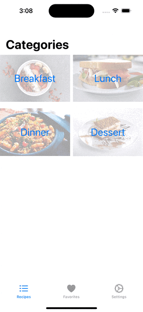

# Cookcademy Mobile App

This project is a hands-on practice focused on creating an application for managing and sharing recipes SwiftUI (For iOS devices). The app lets you view preloaded recipes, add your own, and customize settings for a more personalized experience.


### App Demonstration


## Features
- **Browse Recipes**: Explore a variety of preloaded recipes in each category. Click on a recipe to see details like the author, ingredients, and cooking instructions.


- **Favorites**: Mark recipes as favorites and access them quickly in the 'Favorites' tab. You can also edit recipe details as needed.
  

- **Add Your Own**: Easily add new recipes by clicking the '+' button. Fill in all the details and your recipe is ready.
  

- **Customize Settings**: Change the app's background and text colors. You can also choose to hide optional steps in recipes.
  


## Technologies Used
**SwiftUI**: A modern UI framework by Apple that allows the development of iOS apps.

## Setup and installation
This app can only be previewd on XCode. To set up and run the app locally, follow these steps:
1. Run the following command in your terminal to clone the project repository:
```shell
git clone https://github.com/Joel-Milla/Cookcademy.git
```
2. Open the project file in XCode.
3. Run the app in XCode to see it in action or connect it to your iOS device.
